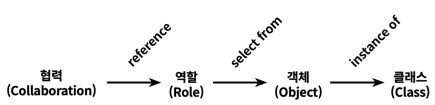

# 3장
# 역할, 책임, 협력
+ **협력** : 객체들이 애플리케이션의 기능을 구현하기 위해 수행하는 상호작용
+ **책임** : 객체가 협력에 참여하기 위해 수행하는 행동
+ **역할** : 객체들이 협력 안에서 수행하는 책임의 집합

## 협력
협력은 객체지향의 세계에서 기능을 구현할 수 있는 유일한 방법으로 **메시지 전송**이라는 유일한 수단으로 객체 사이의 협력을 수행한다.

객체는 상태와 행동을 함께 캡슐화하는 실행 단위이다.   
이러한 객체가 가질 수 있는 상태와 행동은 어떤 기준으로 결정해야 할까?

애플리케이션에 어떤 객체가 필요하다면 그것은 그 객체가 어떤 협력에 참여하고 있기 때문이다.   
그러므로 <u>객체의 행동은 객체가 참여하고 있는 협력</u>에 의해 결정된다.

> 협력은 객체가 필요한 이유와 객체가 수행하는 행동의 동기를 제공한다.

객체의 행동을 결정하는 것이 협력이라면 객체의 상태를 결정하는 것은 행동이다.   
객체의 상태는 그 객체가 행동을 수행하는데 필요한 정보가 무엇인지로 결정된다.

-> 협력은 객체를 설계하는데 필요한 일종의 문맥(context)을 제공한다.

## 책임
>  객체에 의해 정의되는 응집도 있는 행위의 집합

크레이그 라만은 객체의 책임을 크게 **하는 것**과 **아는 것**의 두 가지 범주로 나누어 세분화한다.

+ 하는 것
  + 객체를 생성하거나 계산을 수행하는 등 스스로 하는 것
  + 다른 객체의 행동을 시작시키는 것
  + 다른 객체의 활동을 제어하고 조절하는 것
+ 아는 것
  + 사적인 정보에 관해 아는 것
  + 관련된 객체에 관해 아는 것
  + 자신이 유도하거나 계산할 수 있는 것에 관해 아는 것

객체는 자신이 맡은 책임을 수행하는 데 필요한 정보를 알고 있을 책임이 있다.   
객체는 자신이 할 수 없는 작업을 도와줄 객체를 알고 있을 책임이 있다.

**Information Expert(정보 전문가)패턴** : 책임을 수행하는데 필요한 정보를 가장 잘 알고 있는 전문가에게 그 책임을 할당하는 것

이처럼 책임을 찾고 책임을 수행할 적절한 객체를 찾아 책임을 할당하는 방식으로 협력을 설계하는 방법을 **책임 주도 설계(RDD)**라고 한다.

### 메시지가 객체를 결정한다
객체에게 책임을 할당하는데 필요한 메시지를 먼저 식별하고 메시지를 처리할 객체를 나중에 선택헸는데      
이러한 두 가지 중요한 이유가 있다.
1. 객체가 **최소환의 인터페이스**를 가질 수 있게 된다.
2. 객체는 충분히 **추상적인 인터페이스**를 가질 수 있게 된다.

### 행동이 상태를 결정한다.
데이터 주도 설계(DDD): 객체의 내부 구현에 초점을 맞춘 설계 방법

> 협력 관계 속에서 다른 객체에게 무엇을 제공해야 하고 다른 객체로부터 무엇을 얻어야 하는지를 고민해야만 훌륭한 책임을 수확할 수 있다.

**중요한 것은 상태가 아닌 행동이다.**

## 역할
> 객체가 어떤 특정한 협력 안에서 수행하는 책임의 집합

역할이 중요한 이유는 역할을 통해 유연하고 재사용 가능한 협력을 얻을 수 있기 때문이다.

역할의 개념을 배제하고 금액할인과 비율할인이라는 인스턴스로 바라보면 할인이라는 하나의 역할에 대해서 서로 다른 협력이 만들어지게 된다.   
이는 코드 중복이라는 프로그래밍에서 모든 문제의 근원을 낳는다.

그렇다면 오직 한 종류의 객체만 협력에 참여하는 상황에서도 역할이라는 개념을 고려해야 할까?

레베카 워프스브록은 다음과 같이 말한다.   
> 협력에 참여하는 후보가 여러 종류의 객체에 의해 수행될 필요가 있다면 그 후보는 역할이 되지만 단지 한 종류의 객체만이 협력에 참여할 필요가 있다면 후보는 객체가 된다.

그러므로 협력에 적합한 책임을 수행하는 대상이 한 종류라면 객체로 간주하고 만약 여러 종류의 객체들이 참여할 수 있다면 역할이라고 부르면 된다.

실제 상황에서 어떤 것이 객체이고 역할인지 결정을 내리는 것은 어려운데 저자는 다음과 같은 견해를 갖는다.
> 설계 초반에는 적절한 책임과 협력의 큰 그림을 탐색하는 것이 가장 중요한 목표여야 하고 역할과 객체를 명확하게 구분하는 것은 그렇게 중요하지는 않다

그렇다면 어떤 한 객체는 하나의 역할만을 수행할까?   
당연히 그렇지 않다!

객체는 다양한 역할을 가질 수 있다. 객체는 협력에 참여할 때 협력 안에서 하나의 역할로 보여진다.   
만약 객체가 다른 협력에 참여할 때는 다른 역할로 보여진다.

역할은 특정한 객체의 종류를 캡슐화하기 때문에 동일한 역할을 수행하고 계약을 준수하는 대체 가능한 객체들은 다형적이다.

즉 한 객체가 여러 역할을 수행할 수 있고 다양한 객체가 하나의 역할을 수행할 수 있다.